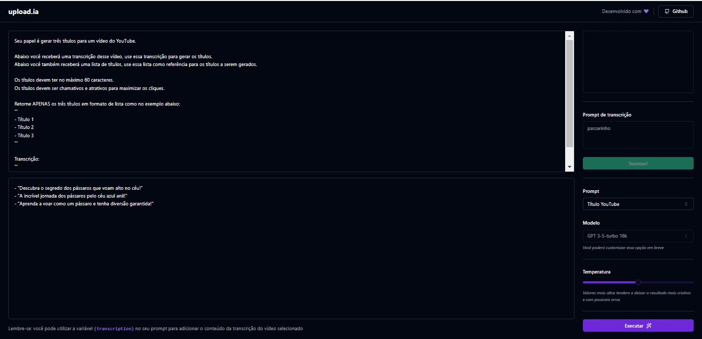
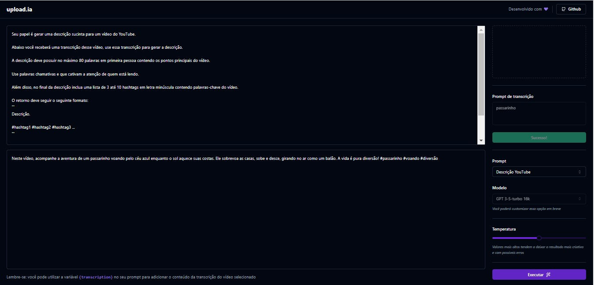

<h1 align="center"> NLW AI </h1>

Projeto desenvolvido em evento NLW promovido pela <a href="https://www.rocketseat.com.br/">Rocketseat</a>.  
<a href="https://app.rocketseat.com.br/certificates/5bd34ebc-9fad-4b1c-a37a-26274a14d832">Certificado</a>

  
  

## 🚀 Tecnologias

Esse projeto foi desenvolvido com as seguintes tecnologias:

- React
- TypeScript
- Prisma
- Fastify
- Zod
- Cors
- Axios
- Tailwindcss
- shadcn/ui
- FFMPEG
- Open AI
- Node e NPM
- Vite

## 💻 Projeto
Foi desenvolvido uma plataforma onde você faz o envio de um vídeo, que é convertido para áudio e feita a transcrição do conteúdo. Após sucesso, o usuário pode escolher entre duas opções de prompt ou editar/incluir o seu próprio. Como sugestões temos: 
1. Sugestão de 3 títulos para o vídeo.
2. Resumo do vídeo.

## 📝 Licença
Esse projeto está sob a licença MIT. Veja o arquivo LICENSE para mais detalhes.

