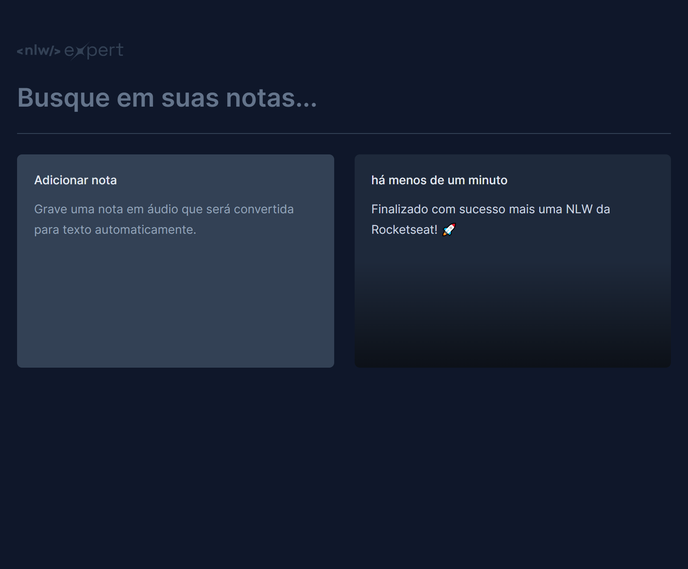
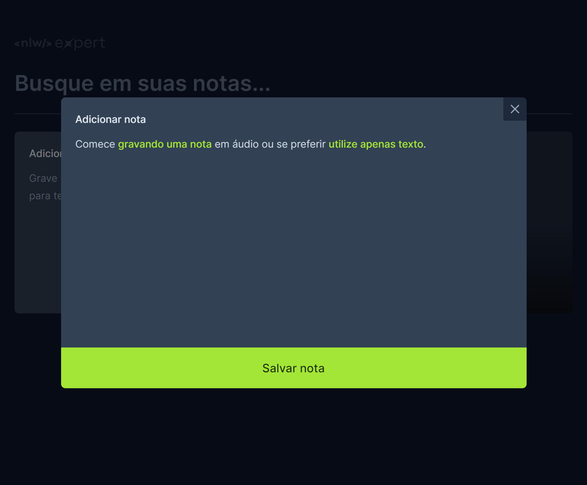
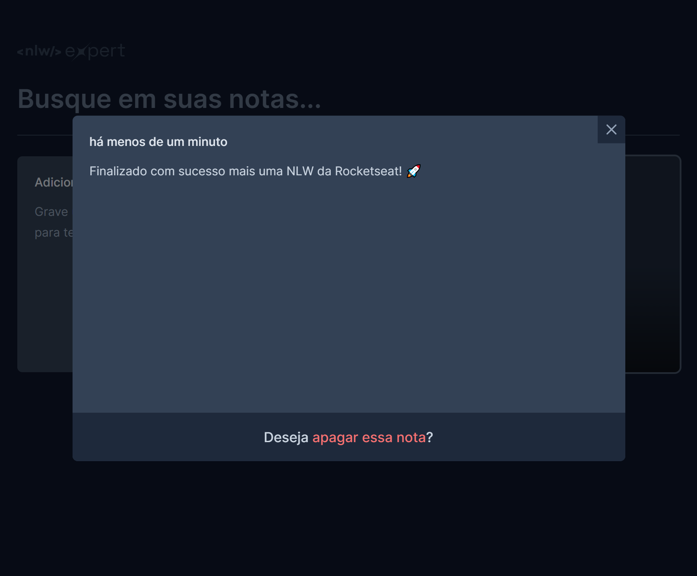

<h1 align="center"> NLW EXPERT - Trilha React </h1>

<p align="center">
Projeto desenvolvido em evento NLW promovido pela <a href="https://www.rocketseat.com.br/">Rocketseat</a>. <br>
<a href="https://app.rocketseat.com.br/certificates/c7caa071-6459-4a86-a102-1cf5935f97b5">Certificado</a>
</p>

## 💻 Projeto
Foi desenvolvido uma aplicação de notas onde você pode inserir em formato de texto ou áudio.

<div align="center">
  
  
  
</div>


## 🚀 Tecnologias
Esse projeto foi desenvolvido com as seguintes tecnologias:

- React
- TypeScript
- SpeechRecognition API
- Tailwindcss


## Executando
Após clonar o repositório, acesse a pasta do projeto e execute os comandos abaixo:

```
npm install
npm run dev
```
Acesse http://localhost:5173 para visualizar a aplicação.


## 📝 Licença
Esse projeto está sob a licença MIT. Veja o arquivo LICENSE para mais detalhes.
