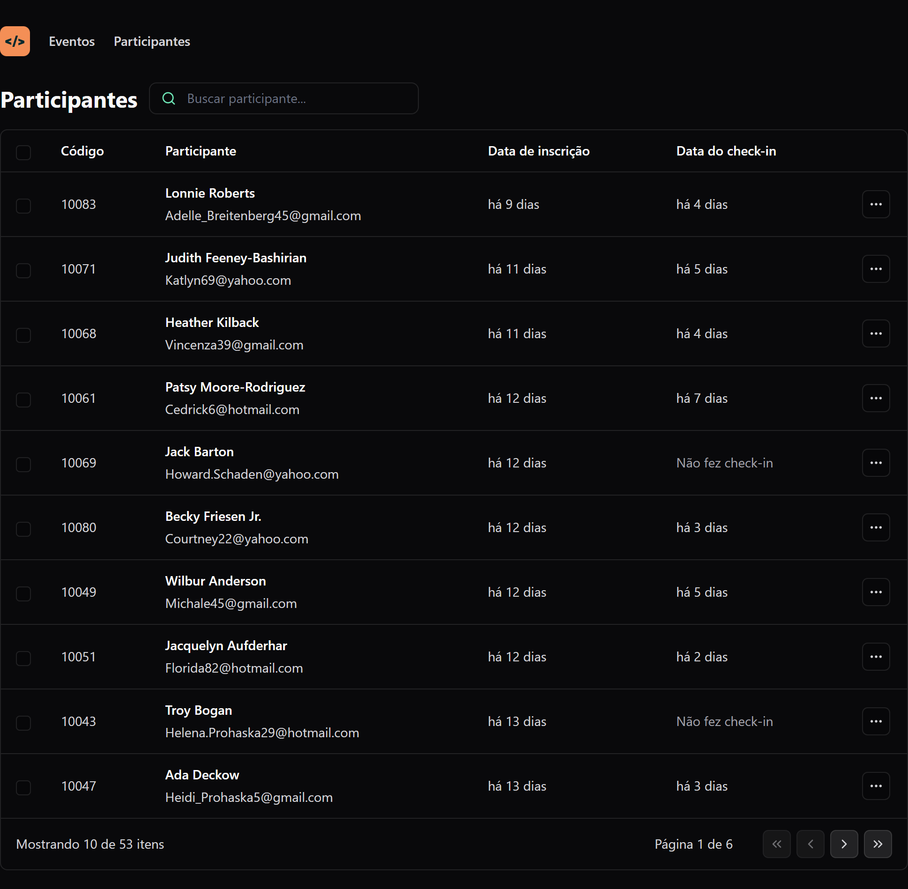

<h1 align="center"> NLW UNITE - Trilha React </h1>

<p align="center">
Projeto desenvolvido em evento NLW promovido pela <a href="https://www.rocketseat.com.br/">Rocketseat</a>. <br>
<a href="https://app.rocketseat.com.br/certificates/2b7825b3-46d2-4c69-8c6e-3cc1ef24a340">Certificado</a>
</p>

## 💻 Projeto
Foi desenvolvido um dashboard com participantes de eventos.

<div align="center">
  
</div>


## 🚀 Tecnologias
Esse projeto foi desenvolvido com as seguintes tecnologias:

- React
- TypeScript
- Tailwindcss
- Lucide React Icons
- Faker JS


## Executando
Após clonar o repositório, acesse a pasta do projeto e execute os comandos abaixo:

```
npm install
npm run dev
```
Acesse http://localhost:5173 para visualizar a aplicação.


## 📝 Licença
Esse projeto está sob a licença MIT. Veja o arquivo LICENSE para mais detalhes.
